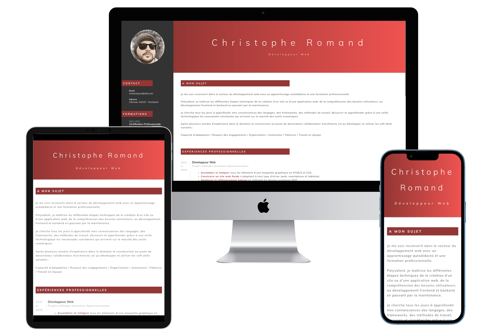

# CV Christophe Romand

##### Environnement :

---

Site: https://ackheron.gitlab.io/cv_christophe-romand_developpeur-web/

### CV développeur web junior

---

### Description

Ce repo contient mon CV de développeur web junior réalisé en HTML5 et Sass. Il présente mes compétences, mon parcours professionnel, mes projets personnels, ainsi que mes informations de contact. Il est conçu pour être clair, concis et attractif pour les employeurs potentiels.

### Technologies utilisées

-   Présentation de mes compétences en développement web
-   Présentation de mon parcours professionnel
-   Présentation de mes projets d'études et personnels
-   Informations de contact
